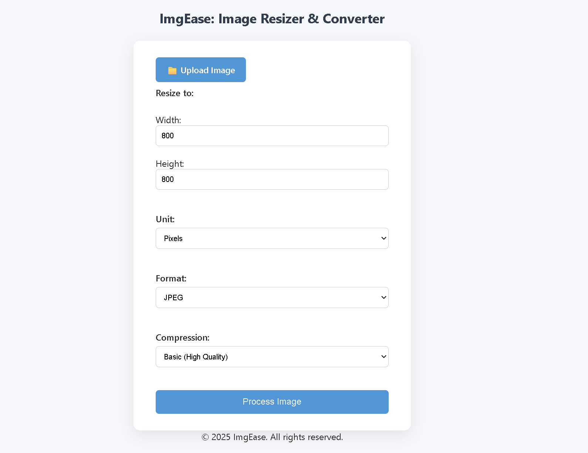

# 🖼️ ImgEase – Image Resizer & Converter

**ImgEase** is a web-based tool built with Python (Flask) that allows users to upload images, resize them in various units (pixels, inches, centimeters), change the format (JPEG, PNG, WEBP), and adjust compression levels — all with an intuitive UI and instant preview.

---

## 🚀 Features

- 📁 Upload and preview images instantly
- 🔧 Resize using pixels, inches, or centimeters
- 🖨 Convert formats: JPEG, PNG, WEBP
- 🗜️ Compression options (High Quality → High Compression)
- 📥 One-click processed image download
- 💡 Modern UI with custom file input and responsive layout

---

## 🛠️ Tech Stack

| Frontend     | Backend       |
|--------------|---------------|
| HTML5, CSS3  | Python 3.x    |
| JavaScript   | Flask         |
| Bootstrap (optional) | Pillow (PIL) |

---

## 📸 Demo Screenshot


---

## 🔧 How to Run Locally

1. **Clone this repo**
   ```bash
   git clone https://github.com/your-username/imgease.git
   cd imgease
   ```

2. **Set up a Virtual Environment** (Recommended)
   - Windows:
     ```bash
     python -m venv venv
     venv\Scripts\activate
     ```
   - macOS/Linux:
     ```bash
     python3 -m venv venv
     source venv/bin/activate
     ```

3. **Install Dependencies**
   ```bash
   pip install -r requirements.txt
   ```

4. **Run the Application**
   ```bash
   python app.py
   ```

5. **Open in Browser**
   Go to [http://localhost:5000](http://localhost:5000)
